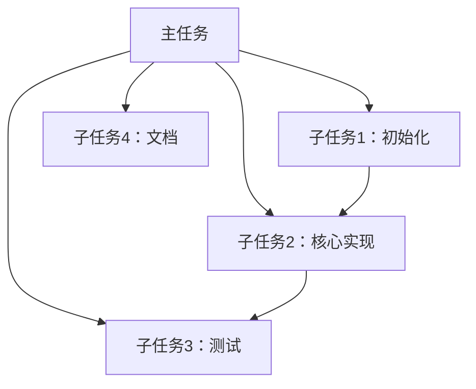

## 新任务工具

### `new_task` 工具与上下文管理策略

#### 概述

Cline 内置了一个强大的内部工具 `new_task`，专为在复杂或长时间任务中帮助管理工作流连续性和上下文保留而设计。该工具结合 Cline 对自身上下文窗口使用情况的感知，以及 `.clinerules` 的灵活性，使你能够采用高级策略来拆分工作并确保任务会话间的无缝衔接。

理解其核心能力及与自定义规则的交互，是高效利用这一特性的关键。

#### 核心能力

两项基础能力支持了高级上下文管理：

1. **`new_task` 工具：**
   - **功能：** 经用户批准后，Cline 可结束当前任务会话并立即开启新会话。
   - **上下文预加载：** 关键在于，Cline 可通过工具的 `<context>` 块预加载新任务会话的特定上下文。该上下文可由 Cline 或 `.clinerules` 文件定义——如摘要、代码片段、下一步、项目状态等。

2. **上下文窗口感知：**
   - **追踪：** Cline 会在任务中内部追踪当前上下文窗口的使用百分比。
   - **可见性：** 该信息会在 prompt 的 `environment_details` 中提供给 Cline。

#### 使用 `/newtask` 斜杠命令

作为 Cline 建议 `newtask` 工具或定义复杂规则的快捷替代，你可以直接在聊天输入框输入 `/newtask`。

- **用法：** 直接输入 `/newtask`。
- **动作：** Cline 会建议创建新任务，通常会基于当前会话自动建议上下文（类似于默认行为）。你仍会收到 `ask_followup_question` 提示以确认并可修改上下文。
- **好处：** 让你能主动快速利用 `new_task` 功能进行分支探索或管理长会话，无需等待 Cline 主动建议。

#### 默认行为（无 `.clinerules`）

在没有特定 `.clinerules` 约束时：

- **工具可用性：** `new_task` 工具存在，Cline 可以选择使用。
- **上下文感知：** Cline 能感知上下文使用百分比。
- **无自动触发：** Cline 不会仅因上下文使用率达到某一百分比（如 50%）就自动发起任务切换，是否建议使用 `new_task` 取决于 AI 模型对任务进展和提示的综合判断。
- **基础上下文预加载：** 若无规则定义 `<context>` 块结构，Cline 会尝试基于当前理解预加载相关信息（如进度摘要和下一步），但可能不如规则驱动方式全面。

#### `.clinerules` 的强大之处：自定义工作流

虽然核心能力默认存在，但将 `new_task` 与上下文感知结合 `.clinerules` 自定义工作流，才能实现真正的自动化与定制化。你可以精准控制 Cline 何时、如何管理上下文与任务衔接。

使用 `.clinerules` 配合 `new_task` 的主要优势：

- **自动上下文管理：** 可定义规则，在上下文百分比（如 >50%、>70%）或 token 数达到阈值时自动触发任务切换，防止上下文丢失。
- **模型特定优化：** 针对不同大模型的已知阈值，定制切换时机。
- **智能断点：** 规则可指示 Cline 在超过阈值后寻找逻辑停顿点（如函数/测试完成后）再切换，保证衔接自然。
- **结构化任务拆解：** 结合 Plan Mode 拆分子任务，配合 `.clinerules` 在每个子任务完成后自动用 `new_task` 创建新任务并预加载下一个子任务上下文。
- **自定义上下文打包：** 可强制 `<context>` 块结构和内容，确保交接信息详尽一致。
- **增强记忆持久性：** 用 `new_task` 的 context 块作为跨会话信息持久化的主要方式，甚至可替代文件型记忆系统。
- **工作流自动化：** 针对特定场景定义规则，如新任务总是预加载某些初始化指令或模板。

#### 示例：规则驱动的任务交接流程

常见的规则驱动工作流（如下例 `.clinerules`）包括以下步骤：

1. **触发识别（基于规则）：** Cline 监控规则定义的交接点（如上下文使用 >50%、任务完成）。
2. **用户确认：** Cline 用 `ask_followup_question` 提议创建新任务，展示规则定义的上下文。

   ```xml
   <ask_followup_question>
     <question>我已完成[具体成果]，且上下文使用率较高（XX%）。需要我创建新任务继续[剩余工作]并预加载以下上下文吗？</question>
     <options>["是，创建新任务", "先修改上下文", "否，继续本会话"]</options>
   </ask_followup_question>
   ```

3. **用户控制：** 你可批准、拒绝或要求 Cline 修改上下文后再创建新任务。
4. **上下文打包（`new_task` 工具）：** 若批准，Cline 用规则要求的结构打包 context 并调用 `new_task`。
5. **新任务创建：** 当前任务结束，立即开启新会话并预加载指定上下文。

#### 交接上下文块（规则定义结构）

规则驱动交接的效果很大程度取决于 `.clinerules` 如何定义 `<context>` 块。常见结构包括：

- **## 已完成工作**：详细列出成果、修改/创建的文件、关键决策
- **## 当前状态**：项目状态、运行进程、关键文件现状
- **## 下一步**：剩余任务清单、实现细节、已知挑战
- **## 参考信息**：链接、代码片段、模式、用户偏好
- **可执行起点**：明确下一步操作指令

#### 典型用例与工作流

`new_task` 与 `.clinerules` 的灵活组合可实现：

- **主动上下文窗口管理：** 达到特定百分比或 token 数自动交接，保持最佳性能
- **智能断点：** 超阈值后在逻辑停顿点交接，保证自然衔接
- **结构化任务拆解：** Plan Mode 拆分子任务，子任务完成后自动新建任务
- **自动会话摘要：** `<context>` 块始终包含上次会话要点
- **预加载模板/初始化：** 新任务自动加载标准指令或模板
- **"记忆库"替代方案：** 用 `new_task` context 块作为跨会话信息持久化的主要方式

建议多尝试 `.clinerules`，探索最适合你的工作流！

#### 示例 `.clinerules`：任务交接策略指南

以下为专注于用 `new_task` 管理上下文窗口的 `.clinerules` 示例。**注意，这只是其中一种策略，`new_task` 工具可结合其他自定义规则灵活使用。**

```markdown
# 你必须使用 `new_task` 工具：任务交接策略指南

**⚠️ 关键指令 - 必须遵循以下指南 ⚠️**

本指南为高效拆解复杂任务和实现平滑任务交接提供**强制性**指令。你**必须**遵循这些指南以确保连续性、上下文保留和高效完成任务。

## ⚠️ 上下文窗口监控 - 必须执行 ⚠️

你**必须**监控环境详情中的上下文窗口使用情况。当使用率超过 50% 时，**必须**用 `new_task` 工具发起任务交接。

上下文窗口使用率超过 50% 的示例（200K 窗口）：

```text
# Context Window Usage
105,000 / 200,000 tokens (53%)
Model: anthropic/claude-3.7-sonnet (200K context window)
```

**重要：** 当你看到上下文窗口使用率达到或超过 50% 时，必须：
1. 完成当前逻辑步骤
2. 用 `ask_followup_question` 工具询问是否创建新任务
3. 若同意，使用 `new_task` 工具并提供完整交接说明

## Plan Mode 任务拆解 - 必须流程

Plan Mode 专为分析复杂任务并拆分为可管理的子任务而设。你**必须**：

### 1. 初始任务分析 - 必须
- **必须**彻底理解用户请求的全部范围
- **必须**识别所有主要组件和依赖
- **必须**考虑潜在挑战、边界情况和前置条件

### 2. 战略性任务拆解 - 必须
- **必须**将整体任务拆分为逻辑独立的子任务
- **必须**按依赖关系优先排序
- **必须**确保子任务可在单次会话内完成（15-30 分钟）
- **必须**考虑自然断点以便上下文切换

### 3. 创建任务路线图 - 必须
- **必须**向用户展示清晰编号的子任务列表
- **必须**解释子任务间依赖
- **必须**尽可能给出时间预估
- **必须**在有帮助时用 Mermaid 图可视化任务流和依赖



### 4. 获取用户确认 - 必须
- **必须**征求用户对任务拆解的反馈
- **必须**根据用户优先级或补充要求调整计划
- **必须**确认从哪个子任务开始
- **必须**请用户切换到 Act Mode 开始实现

## 任务实现与交接流程 - 强制流程

Act Mode 实现任务时，**必须**遵循以下交接指南：

### 1. 聚焦实现 - 必须
- **必须**专注于当前子任务的完整实现
- **必须**通过注释和提交信息清晰记录进展
- **必须**在逻辑完成点创建检查点

### 2. 识别完成点 - 关键
你**必须**在以下情况识别交接点：
- 当前子任务已完成
- 达到较大子任务的逻辑停顿点
- 实现超时，可后续继续
- 任务范围超出原计划
- **关键：** 上下文窗口使用率超过 50%

### 3. 启动交接流程 - 必须
到达完成点时，**必须**：
1. 总结已完成内容
2. 明确剩余工作
3. **必须**用 `ask_followup_question` 工具询问是否创建新任务：

```xml
<ask_followup_question>
  <question>我已完成[具体成果]。需要我创建新任务继续[剩余工作]吗？</question>
  <options>["是，创建新任务", "否，继续本会话", "让我再想想"]</options>
</ask_followup_question>
```

### 4. 用上下文创建新任务 - 必须
若用户同意，**必须**用 `new_task` 工具并提供完整交接说明：

```xml
<new_task>
  <context>
    # 任务续接：[简要任务标题]
    ## 已完成工作
    - [详细已完成项]
    - [具体修改/创建的文件]
    - [重要决策]
    ## 当前状态
    - [项目当前状态描述]
    - [运行进程或环境配置]
    - [关键文件现状]
    ## 下一步
    - [剩余任务清单]
    - [需解决的实现细节]
    - [已知挑战]
    ## 参考信息
    - [相关文档链接]
    - [重要代码片段或模式]
    - [用户偏好]
    请继续按上述说明实现下一步。
  </context>
</new_task>
```

### 5. 详细上下文转移 - 必须包含

#### 项目上下文 - 必须
- **必须**包含项目整体目标和目的
- **必须**包含关键架构决策和模式
- **必须**包含技术栈和依赖

#### 实现细节 - 必须
- **必须**列出本会话创建/修改的文件
- **必须**描述实现的函数、类或组件
- **必须**说明采用的设计模式
- **必须**概述测试方法

#### 进度追踪 - 必须
- **必须**提供已完成项清单
- **必须**提供剩余项清单
- **必须**记录遇到的阻碍或挑战

#### 用户偏好 - 必须
- **必须**记录用户提到的代码风格偏好
- **必须**记录用户要求的具体实现方式
- **必须**突出用户指定的重点

## 有效交接最佳实践 - 强制指南

### 1. 保持连续性 - 必须
- **必须**跨任务用一致术语
- **必须**引用前期决策及其理由
- **必须**除非明确变更，否则保持架构一致

### 2. 保留上下文 - 必须
- **必须**在交接中包含相关代码片段
- **必须**总结上次会话关键讨论
- **必须**在适用时引用具体文件和行号

### 3. 明确下一步 - 必须
- **必须**以明确可执行的下一步开头
- **必须**优先排序剩余任务
- **必须**突出需决策事项

### 4. 记录假设 - 必须
- **必须**清楚说明实现过程中的假设
- **必须**指出需用户补充的地方
- **必须**标明可选方案

### 5. 优化可恢复性 - 必须
- **必须**让下次会话能立即开始
- **必须**如需环境配置，提供设置说明
- **必须**顶部给出快速摘要，便于恢复上下文

## 任务交接示例

### 有效交接示例 #1：

```xml
<new_task>
  <context>
    # 任务续接：实现用户认证系统
    ## 已完成工作
    - 创建了基本 Express.js 服务器结构
    - 实现了 MongoDB 连接和用户 schema
    - 完成了带密码加密的用户注册接口
    - 用 Joi 做了输入校验
    - 为注册接口创建了初始测试套件
    ## 当前状态
    - 服务器成功运行在 3000 端口
    - MongoDB 连接已建立
    - 注册接口（/api/users/register）功能完整
    - 测试套件通过所有注册场景
    ## 下一步
    1. 实现登录接口（/api/users/login）
      - 用 bcrypt 比较密码
      - 登录成功生成 JWT token
      - 错误凭证时做错误处理
    2. 创建认证中间件
      - 校验 JWT token
      - 提取用户信息
      - 处理 token 过期
    3. 添加需认证的受保护路由
    4. 实现密码重置功能
    ## 参考信息
    - JWT 密钥应存于 .env 文件
    - 路由/users.js 中有现有错误处理模式
    - 用户 schema 定义在 models/User.js
    - 测试模式见 tests/auth.test.js
    请按注册接口的模式实现登录接口。
  </context>
</new_task>
```

### 无效交接示例 #2：

（注：原规则中的"YOLO MODE Implementation"更像一般状态更新而非交接上下文块。真正无效的交接通常缺乏"当前状态"或"下一步"细节。）

## 何时使用任务交接 - 强制触发条件

你**必须**在以下场景发起任务交接：

1. **关键：** 上下文窗口使用率超过 50%
2. **长周期项目** 超过单次会话
3. **复杂实现** 涉及多个阶段
4. **接近上下文窗口限制**
5. **切换项目关注点**
6. **需不同专长** 处理不同任务部分

**⚠️ 最后提醒 - 关键指令 ⚠️**

你**必须**监控环境详情中的上下文窗口使用率。超过 50% 时，**必须**用 `ask_followup_question` 工具主动发起交接，然后用 `new_task` 工具。你必须用 `new_task` 工具。

严格遵循这些指南，可确保任务平滑衔接、项目高效推进，为复杂多会话项目用户带来最佳体验。
```

## 用户交互与工作流说明

- **线性流程：** 目前，使用 `new_task` 会创建线性序列。旧任务结束，新任务开始。旧任务历史可回溯。
- **用户批准：** 你始终有控制权，可批准交接并修改 Cline 提议的上下文。
- **灵活性：** `new_task` 工具是灵活的构建块。可结合 `.clinerules` 实现最适合你的上下文管理、任务拆解等工作流。

